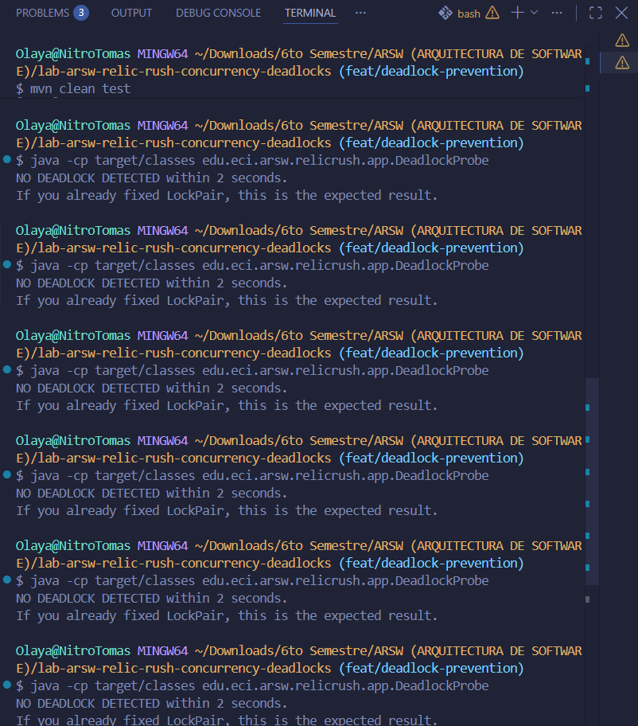

# ARSW Lab 3 - Relic Rush - Delivery Report

## Team

| Student | ID         | GitHub      |
|---|------------|-------------|
| Isaac Burgos |     1000099591       | Isaac1805BC |
| Tomás Olaya Díaz | 1000102228 | iAxstral    |
| Javier Romero | 1000098114 | Deathkiz    |

**Repository:** [lab-arsw-relic-rush-concurrency-deadlocks](https://github.com/iAxstral/lab-arsw-relic-rush-concurrency-deadlocks)

**Development Period:** 2026-2  
**Technology Stack:** Java 21 - Maven - JUnit 5

---

## 1. Baseline observations

> Scope note: the full-game baseline (deadlock behavior of `RelicRushMain` / `DeadlockProbe`) is documented by the Part III/IV owner. This entry covers both the isolated ledger probe (Part II) and the full-game behavior (Part III).

### 1.1 Ledger Race Probe (Part II baseline)

- **Commands executed:**

```bash
mvn -q -DskipTests clean package
java -cp target/classes edu.eci.arsw.relicrush.app.LedgerRaceProbe 64 5000
```

- **Observations:** With the starter `ForgeLedger`, `expected` writes were always higher than both `totalCrafted` and `eventCount`. Every run under-counted, and the shortfall differed from run to run (non-deterministic race).
- **Invariant preserved?** No. `totalCrafted != eventCount != expected` in every run.
- **Unexpected termination?** No crash/exception, just silent lost updates.

**Evidence (starter implementation, 3 consecutive runs, 64 workers x 5000 writes each = 320,000 expected):**

```text
expected=320000 totalCrafted=9368  eventCount=211826 invariant=BROKEN
expected=320000 totalCrafted=9487  eventCount=213772 invariant=BROKEN
expected=320000 totalCrafted=10461 eventCount=210941 invariant=BROKEN
```

**Analysis:** `totalCrafted` lost ~97% of its increments and `eventCount` lost ~34% of its entries. This shows the two bugs manifest at very different severities: a plain `int++` is almost always clobbered under contention, while `ArrayList` occasionally survives a batch before an internal array-resize race drops or corrupts elements.

### 1.2 Full-game deadlock baseline (Part III baseline)

- **Command:** `java -cp target/classes edu.eci.arsw.relicrush.app.DeadlockProbe`
- **Result before fix:** Reproducible deadlock on first run (confirmed in multiple consecutive runs before the fix)

```text
DEADLOCK DETECTED
- probe-A-anvil-then-furnace waiting on edu.eci.arsw.relicrush.model.ForgeStation@50040f0c 
  owned by probe-B-furnace-then-anvil
- probe-B-furnace-then-anvil waiting on edu.eci.arsw.relicrush.model.ForgeStation@65b3120a 
  owned by probe-A-anvil-then-furnace
```

---

## 2. Coordination analysis (Part I)

### 2.1 Responsibility of both barriers

- **`roundStart`**: this is the "start gate" (Scenario A). Every `Adventurer` thread calls `roundStart.await()` at the top of its round loop and blocks there. The coordinator (`GameEngine.run`) also calls `roundStart.await()` once per round. Because a `CyclicBarrier` releases all parties only when the last one arrives, no adventurer can begin `playTurn()` for round *N* until the coordinator has explicitly opened that round. This turns an otherwise free-running set of threads into a lock-step round structure: round *N* cannot start while round *N-1* is still being read/printed by the coordinator, and no adventurer can "peek ahead" into a future round.

- **`roundEnd`**: this is "round completion" (Scenario B). Every adventurer calls `roundEnd.await()` right after finishing `playTurn()` (i.e., after it has already updated its score and recorded its `ForgeEvent` in the `ForgeLedger`). The coordinator blocks on the same barrier before it reads the scoreboard/ledger for `printRoundSnapshot`. This guarantees the coordinator never observes a round's state while any adventurer is still mid-craft — it only reads once every worker has crossed the barrier, i.e., once every worker for that round is done.

### 2.2 Why `Thread.sleep(...)` is not a valid replacement for a barrier

`Thread.sleep(...)` coordinates threads through a *guessed duration*, not through an actual happens-before relationship with the other threads' progress. It is simultaneously:

- **Unsafe**: If a sleep is too short (e.g., under load, GC pause, or scheduling delay), the coordinator can read the scoreboard/ledger while some adventurers are still inside `LockPair.withBoth(...)`, producing a torn read and a `BROKEN` invariant even with correct `ForgeLedger`.

- **Wasteful when it "works"**: To be safe under worst-case scheduling you must sleep for much longer than the typical turn duration, which serializes rounds behind a fixed, pessimistic delay instead of releasing the coordinator the instant the last adventurer actually finishes.

- **Non-portable**: The "safe" sleep duration depends on machine load, thread count, and JIT warm-up, so a value tuned for 8 adventurers is not guaranteed to be sufficient for 128.

A `CyclicBarrier`, in contrast, encodes an exact rendezvous condition (`N` parties must call `await()`) enforced by the JMM, with no arbitrary timing assumption.

### 2.3 Memory-consistency benefit of barrier-based reads

`CyclicBarrier.await()` establishes a happens-before edge: every action performed by a thread *before* it calls `await()` happens-before the actions performed by any thread *after* it returns from the corresponding `await()` (per `java.util.concurrent.CyclicBarrier` Javadoc / JMM). Concretely, every write an adventurer makes to `score` and every `ledger.record(...)` call it performs during `playTurn()` happens-before the coordinator's calls to `Adventurer::score`, `ledger.totalCrafted()`, and `ledger.eventCount()` in `printRoundSnapshot`, because those reads occur only after `roundEnd.await()` returns on the coordinator side. This is what lets the coordinator safely read plain (non-volatile) fields like `Adventurer.score` without any additional synchronization: the barrier itself is the memory fence. Without it, there would be no guarantee the coordinator's thread ever observes the adventurers' writes (visibility), independent of any interleaving/race issue.

---

## 3. Thread-safety problems (Part II)

### 3.1 Identified defects and solutions

| Shared state | Problem | Invariant at risk | Solution | Justification |
|---|---|---|---|---|
| `ForgeLedger.totalCrafted` (was `int`) | `int next = totalCrafted + 1; totalCrafted = next;` is a non-atomic read-modify-write. Concurrent adventurer threads can read the same stale value and overwrite each other's increment (lost update). | `sum of player scores == ForgeLedger.totalCrafted` | Replaced with `AtomicInteger`, updated via `incrementAndGet()` (a single CAS-based atomic operation). | `AtomicInteger` gives lock-free, wait-free atomicity for a single counter without introducing a monitor. It is strictly cheaper than `synchronized` for this specific op (no blocking, no context-switch risk) and does not couple the counter's contention to the list's contention. |
| `ForgeLedger.events` (was `ArrayList<ForgeEvent>`) | `ArrayList` is not designed for concurrent structural modification. Concurrent `add()` calls can race on the internal array/`size` field, silently dropping elements or throwing `ArrayIndexOutOfBoundsException`/`ConcurrentModificationException`. | `ForgeLedger.totalCrafted == number of ForgeEvent entries` | Replaced with `ConcurrentLinkedQueue<ForgeEvent>`, a lock-free (Michael-Scott) concurrent queue; `add()` is safe for any number of concurrent producers. | The list is write-heavy (every craft appends once) and read-rarely (only `eventCount()`/`snapshot()`, called once per round by the coordinator, off the hot path). `ConcurrentLinkedQueue` gives O(1) lock-free `add()`, which is far cheaper under contention than `CopyOnWriteArrayList` (O(n) copy per write — unacceptable here) or `Collections.synchronizedList` (blocking monitor on every write, effectively serializing all adventurers on this field). |

### 3.2 Why fine-grained locking is preferable to coarse-grained

The two invariants only require that (a) each individual field is internally consistent under concurrent access, and (b) both fields are incremented exactly once per crafted relic. They do **not** require the counter update and the list append to be atomic *with respect to each other* — nothing in the game ever reads `totalCrafted` and `events` in a way that assumes they change as a single indivisible unit mid-round; they are only compared for equality by the coordinator, and only after every adventurer has already crossed `roundEnd` (which — per Part I — is itself a memory-consistency fence). So each field can be made independently thread-safe with the cheapest tool that fits its own access pattern, instead of forcing a single global lock around `record()` that would serialize every adventurer's craft on the ledger, turning `ForgeLedger` into a bottleneck shared by every station pair in the game.

`LedgerRaceProbe` stress evidence below confirms both fields stay consistent under heavy concurrent writes without any coarse locking:

```text
expected=320000  totalCrafted=320000  eventCount=320000  invariant=OK   (64 workers  x 5000 writes)
expected=320000  totalCrafted=320000  eventCount=320000  invariant=OK   (repeated 3x)
expected=2560000 totalCrafted=2560000 eventCount=2560000 invariant=OK   (128 workers x 20000 writes)
```

---

## 4. Deadlock diagnosis and prevention (Parts III, IV, V)

### 4.1 Evidence of deadlock in starter code

**Command:** `java -cp target/classes edu.eci.arsw.relicrush.app.DeadlockProbe`

The `DeadlockProbe` launches two daemon threads:
- `probe-A`: acquires `Anvil` and then attempts to acquire `Furnace`
- `probe-B`: acquires `Furnace` and then attempts to acquire `Anvil`

The JVM's `ThreadMXBean.findDeadlockedThreads()` detects the cycle of waiting and reports it directly, without need for external `jstack`/`jcmd` tools.

```text
DEADLOCK DETECTED
- probe-A-anvil-then-furnace waiting on edu.eci.arsw.relicrush.model.ForgeStation@50040f0c 
  owned by probe-B-furnace-then-anvil
- probe-B-furnace-then-anvil waiting on edu.eci.arsw.relicrush.model.ForgeStation@65b3120a 
  owned by probe-A-anvil-then-furnace
```

### 4.2 Coffman conditions in Relic Rush

- **Mutual exclusion:** Each `ForgeStation` is the monitor of itself — the `synchronized(first)`/`synchronized(second)` in `LockPair.withBoth()` guarantees that only one thread at a time can possess a given station.

- **Hold and wait:** In the original `LockPair`, a thread that has already acquired `first` (inside the first `synchronized` block) becomes blocked waiting for `second` **without releasing** `first` — it retains one resource while waiting for another.

- **No preemption:** No thread can be forced to release the lock of a `ForgeStation` it already owns; the JVM/OS cannot "steal" it to break the deadlock — only the owning thread can release it by exiting the `synchronized` block, which never occurs because it is blocked.

- **Circular wait:** `probe-A` requests `Anvil` then waits on `Furnace` (which `probe-B` holds); `probe-B` requests `Furnace` then waits on `Anvil` (which `probe-A` holds) — the cycle closes: A → Furnace → B → Anvil → A.

### 4.3 Wait-for graph

```
    waiting         waiting
  A ────────► Furnace ◄──────── B
  ▲                              │
  │           owns               │ owns
  └──────── Anvil ◄──────────────┘
```

`probe-A` owns `Anvil` and waits for `Furnace` (owned by `probe-B`); `probe-B` owns `Furnace` and waits for `Anvil` (owned by `probe-A`). The closed cycle `A → Furnace → B → Anvil → A` is the characteristic signature of a deadlock — while it exists, no involved thread can progress.

### 4.4 Deadlock prevention strategy

**Condition broken:** **Circular wait.**

**Solution:** Defined a total deterministic order over `ForgeStation` objects (by `id()`) and modified `LockPair.withBoth()` so that, regardless of the order the caller passes the two parameters, it always calculates which has the smaller `id()` and acquires that one first:

```java
public static void withBoth(ForgeStation a, ForgeStation b, Runnable action) {
    ForgeStation first = a.id() < b.id() ? a : b;
    ForgeStation second = a.id() < b.id() ? b : a;
    synchronized (first) {
        synchronized (second) {
            action.run();
        }
    }
}
```

With this strategy, two threads competing for the same pair of stations **always** attempt to acquire the one with the smaller ID first — it becomes mathematically impossible for a cycle of waiting to form, regardless of the order each player logically "requested" the stations.

### 4.5 Preservation of concurrency between independent operations

The global ordering only affects threads competing for the **same exact pair** of stations. Two players that need completely different pairs of stations (with none in common) never wait on each other — each `synchronized` remains fine-grained, one per `ForgeStation`, not a global lock for the entire game.

**Evidence of correctness (6 consecutive runs of `DeadlockProbe`):**



```text
NO DEADLOCK DETECTED within 2 seconds.
If you already fixed LockPair, this is the expected result.
(6/6 consecutive runs, all with this result)
```

---

## 5. Verification (Part VI - Stress Testing)

The full verification run consisted of: a clean build with unit tests, the
isolated `LedgerRaceProbe`, six consecutive `DeadlockProbe` runs, and the
three `InvariantProbe` configurations required by README section 13. Raw
console output for all of these is kept under `docs/evidence/`.

### 5.1 LedgerRaceProbe (isolated ledger, post-fix)

```text
expected=320000  totalCrafted=320000  eventCount=320000  invariant=OK   (64 workers x 5000 writes)
expected=2560000 totalCrafted=2560000 eventCount=2560000 invariant=OK   (128 workers x 20000 writes)
```

### 5.2 DeadlockProbe (post-fix)

Six consecutive runs, all reporting the same result:

```text
NO DEADLOCK DETECTED within 2 seconds.
If you already fixed LockPair, this is the expected result.
```

### 5.3 InvariantProbe - full game, three configurations

| Players | Stations | Rounds | Deadlock? | Invariant across all rounds | Process finished normally |
|---:|---:|---:|---|---|---|
| 8 | 6 | 50 | No | OK (400 / 400 / 400) | Yes, prints FINAL SCORE |
| 32 | 8 | 100 | No | OK (3,200 / 3,200 / 3,200) | Yes, prints FINAL SCORE |
| 128 | 8 | 100 | No | OK (12,800 / 12,800 / 12,800) | Yes, prints FINAL SCORE |

In every one of the three runs, each adventurer ended with exactly
`rounds` relics (e.g. 100 relics each in the 128-players/100-rounds run),
and `Total by players` matched `Ledger total` and `Ledger events` at all
times. No round printed `invariant=BROKEN` and no run hung or crashed.

---

## 6. Architectural trade-offs (Part 14)
## 6. Architectural trade-offs (Part 14)

### Correctness / reliability

The two invariants given in the statement are protected: the sum of the
players' scores must equal `totalCrafted` and the number of `ForgeEvent`
entries, and no station can be used by two crafts at the same time.

`Adventurer` writes its own `score`, meaning only its own thread ever
touches it, so no synchronization was needed there. `ForgeLedger` is
different because it is shared by all the threads, while `ForgeStation`
is an exclusive resource. `ForgeLedger` was solved with `AtomicInteger`
for the counter and `ConcurrentLinkedQueue` for the event list. For
`ForgeStation`, `synchronized` was used per station.

### Performance / throughput

Contention only appears in two specific points: when two players compete
for the same pair of stations, and momentarily inside `ledger.record()`.
A global lock would be bad because any craft by any player would block
all the others, even if each one is using completely different stations.

When two players draw pairs of disjoint stations, they never block each
other, thanks to `LockPair.withBoth()` only taking the monitors of those
two specific stations, which lets them keep running in parallel.

### Maintainability

It is obvious who owns each lock, because each `ForgeStation` is its own
monitor — the relationship is direct, there is no separate lock "for"
the station. The ordering rule lives in a single place, `LockPair.withBoth()`,
which is the only entry point for taking two stations at once, so anyone
who wants to craft has to go through it. The real risk we found is that
if someone in the future manually grabs two `synchronized(station)` blocks
outside of `LockPair`, they can bypass the rule and the deadlock could
come back.

### Scalability

With 8 stations there are C(8,2) = 28 possible pairs. With 8 players
there are almost no collisions, but with 128 players against 8 stations
it eventually happens that many players compete for the same pair and
have to wait their turn. At no point did this contention turn into a
deadlock, but the run with 128 players visibly took longer than the run
with 8.

## 7. Mini ADR

The full decision record for the deadlock-prevention strategy (context,
decision, alternatives considered, quality attributes affected, evidence,
consequences and risks) is documented separately in
[`docs/ADR-001-deadlock-prevention.md`](./ADR-001-deadlock-prevention.md),
as required by README section 15.

---

## 8. Conclusions


- The `ForgeLedger` was made thread-safe with `AtomicInteger` for the
  counter and `ConcurrentLinkedQueue` for the event list, without adding
  any new global lock.
- The deadlock was eliminated by ordering `ForgeStation` acquisition by
  `id()` inside `LockPair.withBoth()`, breaking the circular-wait
  condition while keeping fine-grained, per-station locking.
- Stress testing across 8, 32 and 128 concurrent players confirms the
  round invariant holds in every single round, and that the game keeps
  running with disjoint station pairs executing in parallel.